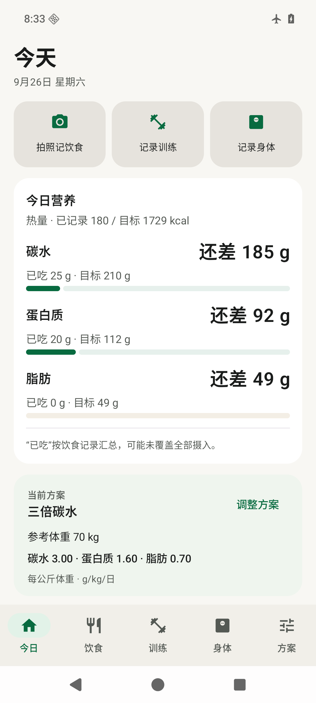
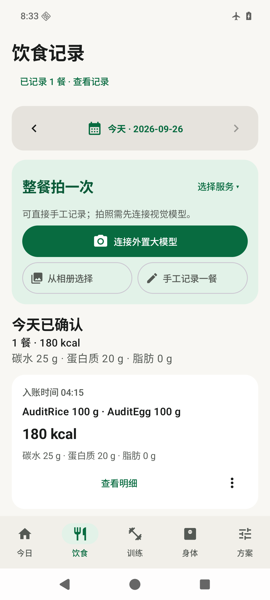
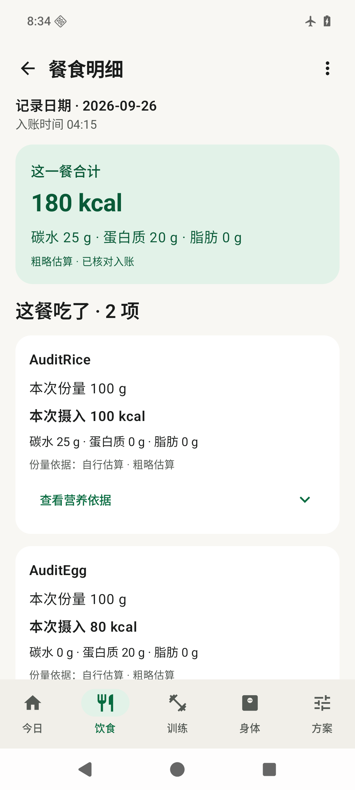

# 健身减脂 · Android 个人账本

记录每天吃了什么、练了什么，以及体重和腰围的变化。支持手工记餐，也可以用自己的视觉模型服务分析整餐照片，核对后再保存。

当前版本：`0.6.0-alpha11`（版本代码 28），支持 Android 9 及以上。以下操作按此版本编写。

界面示例使用合成数据，截图来自模拟器。

## 下载与安装

1. 打开 [v0.6.0-alpha11 下载页](https://github.com/cscpyy-wen/fitness-ledger/releases/tag/v0.6.0-alpha11)，在附件中下载 `fitness-ledger-0.6.0-alpha11.apk`。
2. 在手机上打开 APK，按系统提示允许安装来源安装应用，再完成安装。
3. 已有旧版时，先在 App 中导出加密备份，再直接覆盖安装。不要先卸载或清除应用数据；若提示签名不兼容，请保留旧版和数据，核对安装包。

仓库已公开，无需登录即可查看源码和下载。文件校验与版本边界见[本版发布说明](docs/RELEASE-0.6.0-alpha11.md)。本项目仍是 Alpha 版本；目标使用设备为 Xiaomi 15 Pro / HyperOS 3，当前验收未覆盖该真机。

## 第一次使用：设置每日目标

首次打开会进入“从你的方案开始”。

1. 填写“参考体重 kg”。它用于计算每日营养目标，日常称重不会自动修改这个基准。
2. 选择可编辑示例，或自行填写碳水、蛋白质、脂肪的每日系数，单位是 `g/kg`。每日克数 = 参考体重 × 对应系数。例如 80 kg × 碳水系数 3 = 每天 240 g 碳水，**不是 240 g 米饭**。
3. 展开“更多身体资料”，按本人情况核对身高和参考腰围。起始值不是实测值，不参与宏量目标计算，也不等于保存了一次身体测量。
4. 查看“每日目标预览”，点击“确认并开始使用”。以后从底部“方案”调整，点击“保存我的方案”才生效。

“今日”显示已确认摄入、目标以及还差或超出的量。热量按碳水和蛋白质各 4 kcal/g、脂肪 9 kcal/g 折算。示例只用于起步，不保证产生热量缺口，也不是个体化医疗建议。

实际称重请到“身体 → 记录或补记身体数据”保存。腰围没测就留空，不要把预填值当作测量结果。

## 配置照片识别服务

手工记餐、训练和身体记录不需要模型服务。拍照识别前，打开“方案 → 右上角设置 → 整餐 AI 识别”，或点击“饮食 → 连接外置大模型”。

在“添加服务”中选择 Qwen、DeepSeek、GLM 或自定义，填写服务名称、API 地址、视觉模型 ID 和自己的 API Key，核对照片发送目的地并同意上传后保存启用。API Key 只在手机上输入；服务可能按调用收费。

本版内置的预填值如下，可按账号实际权限修改：

| 服务 | 默认模型 ID | 默认 API 地址 / Base URL |
| --- | --- | --- |
| Qwen / 阿里云百炼 | `qwen3-vl-plus` | `https://dashscope.aliyuncs.com/compatible-mode/v1` |
| DeepSeek | `deepseek-flash` | `https://api.deepseek.com` |
| GLM / 智谱 | `glm-4.6v` | `https://open.bigmodel.cn/api/paas/v4` |
| 自定义 | 自行填写支持图片的模型 | HTTPS Chat Completions 兼容地址 |

预置只是填写起点，保存成功不代表联网验证通过。必须使用账号可调用、支持图片输入的模型；文本模型不能用于整餐照片。百炼地址、Key 与模型须属于同一地区和业务空间。GLM 可按账号权限改为 `glm-5.3-flash`，本版会使用其 low 思考档。兼容说明与官方文档入口见[多服务配置说明](docs/multi-provider-vision.md)。

可以保存多个独立连接，在饮食页“整餐拍一次”右侧切换。保存和切换不调用模型、不改变已有草稿；识别失败不会自动重试或切换供应商。编辑同一服务且地址不变时，Key 留空可保留；更换地址须重新输入。删除当前服务会停用上传。

## 记录一餐：拍照、核对、确认

1. 打开“饮食”，核对日期。可以选择过去日期补录，不能记录未来日期。
2. 点击“拍整餐并识别”或“从相册选择”，把主食、菜和饮品尽量拍全。选择照片后会向当前服务发送识别请求。
3. 在草稿中检查食物名称、克重、营养和份量依据。修改识别不准的项目，删除没吃的食物；漏项可通过“补充漏识别的食材、油或酱汁”添加。整菜已包含的油和酱汁不要重复添加。
4. 合餐或没吃完时，点击“我吃了多少？”，按**当前克重**选 ¼、½、¾ 或全部，也可直接编辑克重。调整份量不会再次调用模型。
5. 点击“下一步：核对并确认”，检查日期和合计，勾选“我已核对食材、克重、烹调油和酱汁”，再确认入账。看到“已计入饮食账本”后，这餐才进入统计。

AI 数值是可修改的估算：单张照片无法准确测量隐藏的油、配方、遮挡部分或实际食用量。已知称量和包装标签也要对应到你实际吃下的食物。草稿在确认前不会改变今日摄入。

没有照片或服务不可用时，选择“手工记录一餐”：填写名称、本次克重和每 100 g 营养，再核对确认。包装食品可填标签热量和来源，普通食物可由三大营养素折算热量。“最近与收藏”可按本次克重复用食物；“换算食物份量”仅用于对照，不会自动记餐。

## 给 AI 补充已知信息

打开“方案 → 设置 → 附加提示词 → 编辑附加提示词”，可保存最多 2000 字符。所有模型服务共用，保存后下一次识别才生效，不会修改已有草稿。

例如，你已确认餐盘和米饭的称量条件时，可以填写：

> 仅当可确认是白色方形分格餐盘，且米饭完整未吃过时，米饭为已称量熟重200g；无法确认则不套用；其他菜利用相对体积结合密度估算，不按面积直接换算重量。

“填入食堂餐盘示例”只填编辑框，需你核对后保存。只有同一份米饭确实称过、且条件成立，才能写“已称量熟重 200 g”；若只是食堂标称或大约 200 g，请明确写“约 200 g”。餐盘外观相同不能证明重量，最终仍要核对草稿。

附加说明会随照片发送，请勿填写密码、API Key 或无关个人信息。更多说明见[提示词与份量参照](docs/meal-analysis-prompts.md)。

## 查看和更正饮食历史

在“饮食”选择日期，点击“已记录 N 餐 · 查看记录 → 查看明细”。可查看本次克重、热量、三大营养素、份量依据和可靠性；展开营养依据可查看每 100 g 数值、来源及热量口径。

每餐“更多操作”提供：

- “更正这餐”：生成更正草稿，确认保存后替换原餐，保留原日期与入账时间。
- “复制为草稿”：生成待确认草稿，核对目标日期和份量后再入账，不会直接重复记录。
- “删除这餐”：再次确认后删除并更新统计。

查看明细不会重新识别。此版本不保留已确认餐食照片；“入账时间”不是实际进餐时间，也没有早、中、晚餐分类。若提示明细缺失，原营养合计仍保留，但不能用不完整明细更正或复制整餐。

## 训练、自定义动作与 PR

进入“训练 → 开始训练”，选择动作，填写重量与次数或时长，完成一组后点击“记录一组”。动作支持中文、拼音和英文搜索；杠铃统一填写**包含杆和两侧杠铃片的总重量**。

首组后可重复或撤销上一组，也可逐组修改、删除。RPE、RIR、备注、热身、失败、超级组和休息设置按需展开。“5×5”确认后会直接记为五条已完成组，请在确实完成后使用。整场结束点击“完成训练并计算 PR”，再按提示确认。

在“动作库 → 新建”填写名称、主要肌群和记录方式，支持重量次数、自重次数、辅助重量次数和计时。创建后可修改名称、肌群等信息，记录方式不能改；“管理”中可归档或恢复自定义动作。归档会从新训练选择器隐藏动作，历史和 PR 仍保留。

PR 指个人训练纪录，完成训练后计算，热身和失败组不参与。第一次有效表现显示“建立基准”，之后进步才显示“刷新纪录”；`5RM（训练记录）` 来自恰好 5 次的有效组，不要求做极限测试。

“训练历史”可查看每一组，通过“更正本场”修改并在保存后重算 PR。也可保存模板或“复制上一场为新计划”；它们只预填安排，仍需逐组实际记录。

## 身体趋势与小米称重同步

在“身体 → 记录或补记身体数据”选择日期，填写体重及可选腰围；手工记录同一天再次保存会更新当天记录，可编辑或删除。趋势可看近 4 周或 8 周及 7 日均重。每天优先采用手工体重，否则取当天最早一次小米称重；缺测日期不按 0 计算。

若称重已同步到小米运动健康云端，可在“身体 → 小米运动健康 → 连接并自动同步”阅读说明，由本人在小米官方页面登录，再返回 App：

- 默认查询近 7 天；“同步设置 → 补齐近 8 周”可补录近 56 天，并非全部历史。
- 称重后先让小米端完成云端同步，再点“立即同步”。App 不直接连接 S400 或其他秤。
- 后台约每 2 小时尝试，受网络、电量和 HyperOS 后台限制影响，可能延后，不保证称重后立即到账。
- 只显示返回的体重、体脂率、体水分原值，缺失留空。小米原值不能在 App 内编辑，可隐藏；同步不改变方案参考体重或营养目标。

此功能使用中国大陆的非官方云端会话通路，并非仅限体重权限的官方 OAuth，会话可能有更广账号权限。本版按单人账号使用，不会自动区分家庭成员；接口变化或会话过期可能需要重新连接。断开后清除本机会话并停止同步，已导入记录保留。详见[小米接入说明](docs/xiaomi-cloud-integration.md)。

## 备份、换机与覆盖升级

打开“方案 → 设置 → 加密备份与恢复”：

- “导出加密备份”：选择保存位置，设置至少 8 个字符的口令。把文件和口令分开保管；App 不保存口令，忘记后无法恢复该备份。
- “从备份恢复”：选文件、输入口令。恢复会用备份**整体替换当前账本，不合并**；先导出当前数据再操作。
- 备份包含身体、饮食、训练、草稿、模板、仍保留的账本照片和附加提示词；不包含模型连接、API Key、代理令牌或小米会话。恢复后须重新配置模型服务和小米连接。

升级前也建议备份，再用同包名、同长期签名的 APK 覆盖安装。App 默认关闭 Android 云备份和设备迁移备份，不能把系统换机功能当作账本备份。

## 隐私与常见问题

身体、饮食和训练账本保存在本机。启用 AI 后，餐食照片去除 EXIF 并压缩，与固定估算提示和附加说明发送给所选服务；不会自动附带身体、训练或小米账本。确认入账或丢弃后会删除 App 内的草稿照片。API Key 和小米会话由 Android Keystore 加密保存，服务端留存与计费以供应商政策为准。

**保存服务后为什么仍识别失败？** 保存只保存配置。检查网络、地址、Key 所属地区、模型图片权限、余额和配额，再明确重试。超时后的手动重试可能再次计费，App 不会自动重试。

**为什么餐食没计入今日？** 检查是否还在草稿、是否完成最后核对，以及计入日期是否为今天。查看、复制或调整草稿不会直接入账。

**为什么体重变了，目标没变？** 实测体重与方案参考体重分开保存。需要调整目标时，到“方案”修改并保存。

**小米记录没出现怎么办？** 先确认小米端已上传云端，再点“立即同步”；查看状态，必要时重新连接。后台延迟或云端缺失指标，不会由 App 编造补齐。

**AI 精度和真机适配验证到什么程度？** 当前自动化和模拟器验收验证操作、数据和异常处理，没有证明真实餐图营养精度，也未完成 Xiaomi 15 Pro / HyperOS 3 真机验收。范围见[本版发布说明](docs/RELEASE-0.6.0-alpha11.md)。

## 开源许可

本项目以 **GPL-3.0-or-later** 开源，完整条款见 [LICENSE](LICENSE)，适用范围和第三方组件例外见 [开源声明](OPEN_SOURCE_NOTICE.md)。欢迎研究、修改和贡献；再分发时请遵守许可证及相应源码提供要求。项目不提供营养精度或医疗效果保证。

## 更多资料

- [当前版本改进](docs/alpha11-comfort-polish.md) · [整餐识别说明](docs/whole-meal-vision.md) · [每餐明细说明](docs/alpha10-meal-details-audit.md)
- [开发与验证](docs/DEVELOPMENT.md) · [发布规则](RELEASE_SECURITY.md) · [自建识别代理](server/README.md) · [第三方组件说明](THIRD_PARTY_NOTICES.md)
